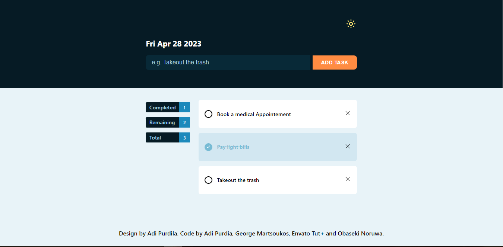

## TodoApp built with HTML, CSS & JavaScript

Basic TodoApp practice on DOM manipulation using some javaScript helper functions: createElement, setAttribute, removeAttribute, hasAttribute, prepend. LocalStorage is being used to save task/todo. Added light/dark theme to the project.

Envato Tut+ - TodoApp with HTML, CSS, javaScript, LocalStorage [youtube.come](https://www.youtube.com/watch?v=y71CdVq5SvI&pp=ygUnZW52YXRvIGxvY2Fsc3RvcmFnZSBodG1sIGNzcyBqYXZhc2NyaXB0)

## Setup

Make sure to install the dependencies:

```bash
# yarn
yarn install

# npm
npm install

# pnpm
pnpm install
```

## Preview

```bash
# Light mode



# Dark mode


```
